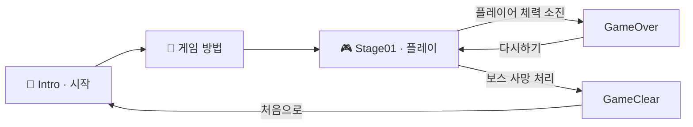
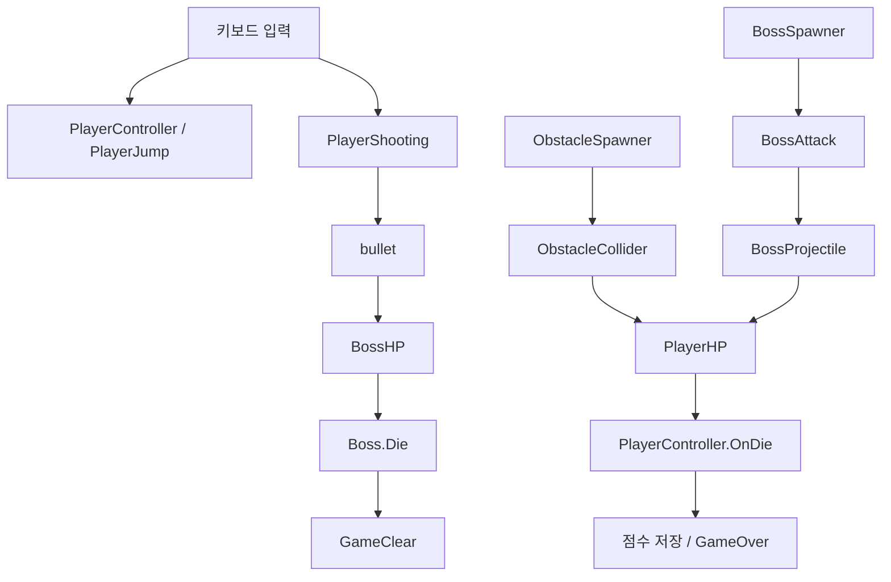

<div align="center">

# 🐧 달펭이: 달리는 펭귄의 이야기

**장애물은 점프로 넘고, 보스는 투사체로 공격하는 2D 러닝 액션 게임**

`Unity 2021.3.20f1` · `C#` · `2D` · `팀 5P`


**Space로 2단 점프 · M으로 공격 · 보스를 쓰러뜨리고 클리어!**

</div>

---

## 📖 목차

- [게임 소개](#about)
- [플레이 방법과 화면 흐름](#play)
- [핵심 시스템](#systems)
- [현재 게임 설정값](#settings)
- [설치와 실행](#setup)
- [프로젝트 구조](#structure)
- [전체 게임 스크립트 안내](#scripts)
- [구현 상태와 확인할 부분](#notes)
- [사용 에셋과 저장소 관리](#assets)

<a id="about"></a>

## 🎮 게임 소개

**달펭이**는 **‘달리는 펭귄의 이야기’**를 줄인 이름으로, 펭귄 캐릭터가 장애물과 보스의 공격을 피하며 싸우는 Unity 2D 게임입니다. 화면 오른쪽에서 왼쪽으로 이동하는 장애물을 점프로 넘고, 보스에게 투사체를 발사하는 것이 플레이의 중심입니다.

한 개의 메인 스테이지인 `Stage01`과 시작·안내·결과 화면으로 구성되어 있습니다. 플레이어와 보스는 각각 체력을 가지며, 플레이어의 체력이 소진되면 게임 오버 화면으로, 보스의 사망 처리가 실행되면 클리어 화면으로 이동합니다.

| 구분 | 내용 |
| --- | --- |
| 게임명 | 달펭이: 달리는 펭귄의 이야기 |
| 제작 표기 | 팀 5P — 프로젝트 타이틀 이미지 기준 |
| 장르 | 2D 러닝 액션 / 보스 슈팅 |
| 주요 조작 | 키보드 점프·공격, 마우스 UI 선택 |
| 구성 | 플레이 스테이지 1개 + 시작·안내·결과 씬 4개 |
| 표현 방식 | 2D 스프라이트, 픽셀 아트 배경, 캐릭터 애니메이션 |
| 프로젝트 내부 이름 | `Korean-rice-cake-run_animationaddver` |

<a id="play"></a>

## 🕹️ 플레이 방법과 화면 흐름

### 조작키

| 입력 | 동작 | 사용 방법 |
| --- | --- | --- |
| `Space` | 점프 | 한 번 눌러 점프하고 공중에서 다시 눌러 2단 점프 |
| `M` | 공격 | 오른쪽으로 투사체 발사. 누를 때마다 공격하며 발사 대기시간 적용 |
| 마우스 클릭 | 메뉴 선택 | 시작, 진행, 다시하기 등 화면 버튼 선택 |

착지하면 점프 가능 횟수가 초기화됩니다. 공격은 키를 계속 누르는 자동 연사 방식이 아니라 `GetKeyDown`으로 새 입력을 감지하는 방식입니다.

`PlayerJump`에는 좌우 방향키 또는 `A`·`D`에 해당하는 `Horizontal` 입력을 점프 힘에 반영하는 코드도 있습니다. 다만 같은 캐릭터의 `PlayerController`도 점프 속도를 변경하므로, 실제 수평 점프 동작은 플레이 검증이 필요합니다.

### 플레이 목표

1. 시작 화면에서 게임 방법 화면으로 이동합니다.
2. 안내를 확인하고 `Stage01`에 진입합니다.
3. 다가오는 장애물을 점프와 2단 점프로 피하며 체력을 유지합니다.
4. 보스의 투사체를 피하면서 `M` 키로 공격합니다.
5. 보스를 처치해 클리어하거나, 게임 오버 후 다시 도전합니다.

### 씬 이동



| 씬 | 설명 |
| --- | --- |
| `Intro` | 게임 타이틀과 진입 화면 |
| `게임 방법` | 조작법과 플레이 안내 |
| `Stage01` | 플레이어, 장애물, 보스, 체력 UI가 배치된 메인 씬 |
| `GameOver` | 게임 오버 및 `Stage01` 재시작 |
| `GameClear` | 클리어 결과 및 `Intro` 복귀 |

위 순서대로 다섯 씬이 Build Settings에 등록되어 있습니다. 보스 등장 시점과 접촉 시 클리어 동작은 아래 [구현 상태](#notes)에 별도로 설명합니다.

<a id="systems"></a>

## ⚙️ 핵심 시스템

### 1. 점프와 캐릭터 애니메이션

- `PlayerController`가 `Physics2D.OverlapCircle`로 발밑 지면을 검사합니다.
- `Space` 입력 시 `Rigidbody2D`의 위쪽 속도를 설정하고, 키를 놓으면 남은 점프 횟수를 줄입니다.
- 착지 시 설정된 점프 횟수로 복구합니다. 현재 씬의 설정은 **2회**입니다.
- `PlayerJump`는 별도로 점프 힘을 적용하고 `Jump_1006` 애니메이션을 재생합니다.

### 2. 플레이어 공격과 피격

- `PlayerShooting`이 공격 간격을 검사하고 `Bullet` 프리팹을 생성합니다.
- 생성된 투사체는 오른쪽으로 이동합니다.
- `bullet`이 `Boss` 태그와의 충돌을 감지하면 보스 체력을 감소시키고 투사체를 제거합니다.
- 장애물과 보스 투사체는 플레이어에게 피해를 줍니다.
- 플레이어가 맞으면 스프라이트가 **0.1초간 빨간색**으로 변합니다. 이 색상 효과 자체가 무적 시간을 제공하지는 않습니다.

### 3. 장애물과 보스 생성

`Stage01`에는 `ObstacleSpawner` 컴포넌트가 **2개** 있으며 서로 다른 장애물 프리팹을 참조합니다. 각각 4~8초의 무작위 간격으로 최대 4개를 생성합니다. 생성된 장애물의 이동 속도는 스포너가 4로 지정합니다.

각 스포너는 마지막 생성 뒤 대기까지 마치면 경고 문구를 1초 동안 표시하고 보스 참조를 활성화하는 코드를 실행합니다. 경고 문구는 `TMPColor`에 의해 검정과 빨강 사이에서 색이 바뀝니다.

이와 별도로 `BossSpawner`는 시작 시 보스와 체력 바를 생성하고, 이후 **27초 간격으로 반복 생성**합니다. 따라서 현재 구현을 ‘장애물을 모두 피한 뒤 보스가 딱 한 번 등장한다’고 해석하면 안 됩니다.

### 4. 보스 공격 패턴

`BossAttack`은 매 공격마다 다음 세 가지 중 하나를 무작위로 선택합니다.

| 패턴 | 현재 코드의 동작 |
| --- | --- |
| 세로 3발 | 높이를 0.4씩 달리한 투사체 3개가 왼쪽으로 이동 |
| 방사 방향 14발 | 생성 위치를 왼쪽으로 달리하면서 14개 투사체에 서로 다른 원형 방향의 속도를 부여 |
| 각도 차이가 있는 5발 | 가로 위치를 0.5씩 달리한 투사체 5개에 조금씩 다른 왼쪽 방향 속도를 부여 |

보스 프리팹의 공격 간격은 **2.7초**, 투사체 속도는 **6**입니다. 세 번째 패턴은 생성 순간의 방향만 계산하며, 발사 후 계속 회전하는 별도 이동 코드는 없습니다.

### 5. 체력과 결과 처리

- 플레이어 체력은 `PlayerHP`, 보스 체력은 `BossHP`가 관리합니다.
- 체력 바는 현재 체력을 최대 체력으로 나눈 비율을 표시합니다.
- 보스 체력 바는 생성 시 보스와 연결되고, 화면 좌표로 변환한 보스 위치에 설정된 오프셋을 더해 배치됩니다.
- 보스가 피격되면 **0.05초간 빨간색**으로 표시됩니다.
- 플레이어 체력이 0 이하가 되면 점수를 저장한 뒤 `GameOver`로 이동합니다.
- `Boss.Die()`는 사망 이벤트를 호출하고 50점을 더한 뒤 보스를 제거하고 `GameClear`로 이동합니다.

### 6. 점수와 저장

`PlayerController.Score`는 점수를 0 이상으로 유지합니다. `PlayerScoreViewer`에는 `Score 숫자` 형식으로 값을 표시하는 코드가 있고, 플레이어 사망 시 `PlayerPrefs`의 `Score` 키에 점수를 저장합니다.

다만 현재 게임 씬·프리팹에서 `PlayerScoreViewer`의 연결은 확인되지 않았습니다. 저장한 점수를 읽어 결과 화면이나 최고 점수로 표시하는 별도 게임 스크립트도 없습니다. 따라서 **점수 관리 코드는 존재하지만 완성된 점수판·랭킹 기능으로 설명하지 않습니다.**

### 7. 배경과 화면 밖 오브젝트 정리

- `CloudSpawner`가 스테이지 범위 안의 무작위 X 위치에 구름을 2.5초마다 생성합니다.
- `CloudScroller`가 구름을 왼쪽으로 이동시킵니다.
- `StageData`는 스테이지의 최소·최대 좌표를 공유하는 `ScriptableObject`입니다.
- `PositionAutoDestroyer`는 스테이지 경계에서 2만큼 더 벗어난 오브젝트를 제거합니다. 구름, 장애물, 양쪽 투사체 프리팹에 연결되어 있습니다.

<a id="settings"></a>

## 🔧 현재 게임 설정값

**스크립트에 적힌 기본값보다 씬과 프리팹에 저장된 Inspector 값이 우선합니다.** 아래는 현재 저장된 설정을 기준으로 합니다.

| 대상 | 항목 | 값 | 설정 위치 |
| --- | --- | --- | --- |
| 플레이어 | 최대 체력 | 20 | `Stage01` → `PlayerHP` |
| 플레이어 | 점프 횟수 / 점프 속도 | 2회 / 8 | `Stage01` → `PlayerController` |
| 플레이어 | 지면 검사 반경 | 0.35 | `Stage01` → `PlayerController` |
| 플레이어 | 발사 간격 / 투사체 속도 | 0.4초 / 15 | `Stage01` → `PlayerShooting` |
| 플레이어 투사체 | 피해량 | 4 | `Bullet.prefab` → `bullet` |
| 장애물 | 생성 간격 / 생성 수 | 4~8초 / 스포너당 4개 | `Stage01` → `ObstacleSpawner` 2개 |
| 장애물 | 생성 후 이동 속도 / 접촉 피해 | 4 / 1 | 스포너 / `Enemy01`, `Enemy02` 프리팹 |
| 보스 | 최대 체력 / 접촉 피해 | 50 / 6 | `Boss.prefab` |
| 보스 | 처치 점수 | 50 | `Boss.prefab` → `Boss` |
| 보스 | 반복 생성 간격 | 27초, 첫 생성은 즉시 | `Stage01` → `BossSpawner` |
| 보스 | 공격 간격 / 투사체 속도 | 2.7초 / 6 | `Boss.prefab` → `BossAttack` |
| 보스 투사체 | 피해량 | 2 | `BossBullet.prefab` |
| 구름 | 생성 간격 / 이동 속도 | 2.5초 / 3 | `Stage01` / `cloud1.prefab` |
| 스테이지 | 최소 / 최대 좌표 | (-11.4, -5) / (11.4, 5) | `Assets/Stage01.asset` |

속도와 좌표는 Unity 월드 단위입니다. 플레이어의 `PlayerShooting.damage = 20`은 **보스 직접 접촉 처리용 값**이며, 발사된 투사체의 피해량 4와 다릅니다.

<a id="setup"></a>

## 🚀 설치와 실행

### 개발 환경

| 구성 | 버전 또는 용도 |
| --- | --- |
| Unity Editor | **2021.3.20f1** |
| 언어 | C# |
| 물리 / 입력 | Physics 2D / 기존 `UnityEngine.Input` |
| UI | Unity UI 1.0.0, TextMesh Pro 3.0.6 |
| 포함 패키지 | 2D Feature 1.0.0, Visual Scripting 1.8.0, Timeline 1.6.4, Recorder 3.0.3 |

전체 의존성은 [manifest.json](Packages/manifest.json), 에디터 버전은 [ProjectVersion.txt](ProjectSettings/ProjectVersion.txt)에 기록되어 있습니다. 패키지 포함 여부가 해당 기능을 게임에서 사용한다는 의미는 아닙니다.

### 에디터에서 실행하기

1. 저장소를 클론하거나 ZIP으로 내려받아 압축을 풉니다.
2. Unity Hub에서 **2021.3.20f1** 에디터를 설치합니다.
3. Unity Hub의 프로젝트 추가 기능으로 `Assets`, `Packages`, `ProjectSettings`가 있는 루트 폴더를 선택합니다.
4. 프로젝트를 열고 패키지 복원과 에셋 임포트가 끝날 때까지 기다립니다. 최초 복원 시 인터넷 연결이 필요할 수 있습니다.
5. `Assets/Scenes/Intro.unity`를 엽니다.
6. 상단 **Play**를 누르고 Game 뷰를 클릭한 뒤 플레이합니다.

게임 로직만 확인할 때는 `Stage01.unity`를 바로 열어 실행할 수 있습니다.

### 실행 파일 만들기

1. `File > Build Settings`를 엽니다.
2. 씬 목록이 `Intro` → `게임 방법` → `Stage01` → `GameOver` → `GameClear` 순서인지 확인합니다.
3. 대상 플랫폼과 해당 Unity 빌드 모듈을 준비합니다.
4. Console의 컴파일 오류를 해결한 뒤 **Build** 또는 **Build And Run**을 선택합니다.
5. 출력 폴더는 Git에서 제외되는 `Builds/` 등을 사용합니다.

현재 플랫폼별 빌드는 검증되지 않았습니다. 특히 `PlayerController.cs`의 `using UnityEditor;`는 플레이어 빌드 시 문제가 될 수 있으므로, 사용하지 않는 해당 import를 정리해야 합니다.

<a id="structure"></a>

## 🗂️ 프로젝트 구조

```text
프로젝트 루트/
├── Assets/
│   ├── Animation/        # 애니메이션 클립과 Animator Controller
│   ├── picture_/         # 게임 타이틀, 조작법, 메뉴·결과 이미지
│   ├── Prefabs/          # 보스, 투사체, 장애물, 구름, UI
│   ├── Scenes/           # 게임 씬 5개
│   ├── Scripts/          # 게임 스크립트 25개
│   ├── Jump.cs           # Animator 상태 동작용 빈 클래스
│   ├── Stage01.asset     # 스테이지 좌표 데이터
│   └── 외부 에셋 폴더/   # 캐릭터·배경·폰트 및 데모 자료
├── Packages/             # 패키지 목록과 잠금 파일
├── ProjectSettings/      # 에디터, 빌드, 입력, 물리 등 설정
├── .gitignore            # 자동 생성 파일 제외 규칙
└── README.md
```

<a id="scripts"></a>

## 🧩 전체 게임 스크립트 안내

파일 이름을 누르면 해당 소스를 볼 수 있습니다. 아래 목록은 `Assets/Scripts`의 **25개 파일 전체**와 루트의 `Jump.cs`를 포함합니다.

### 플레이어 · 투사체

| 파일 | 담당 기능 |
| --- | --- |
| [PlayerController.cs](Assets/Scripts/PlayerController.cs) | 지면 검사, 점프 횟수와 속도, 점수 관리, 사망 시 점수 저장·씬 전환 |
| [PlayerJump.cs](Assets/Scripts/PlayerJump.cs) | 조건부 점프 힘 적용, 수평 입력 반영, 점프 애니메이션 재생 |
| [PlayerShooting.cs](Assets/Scripts/PlayerShooting.cs) | M 키 발사, 발사 간격·속도 관리, 보스 직접 접촉 처리 |
| [bullet.cs](Assets/Scripts/bullet.cs) | 플레이어 투사체의 보스 피격 처리와 자기 제거 |
| [PlayerHP.cs](Assets/Scripts/PlayerHP.cs) | 플레이어 체력 초기화, 피해, 피격 색상, 사망 호출 |
| [PlayerHPViewer.cs](Assets/Scripts/PlayerHPViewer.cs) | 플레이어 체력 비율을 Slider에 반영 |
| [PlayerScoreViewer.cs](Assets/Scripts/PlayerScoreViewer.cs) | TextMesh Pro 점수 표시 로직. 현재 게임 씬·프리팹 연결 미확인 |

### 보스

| 파일 | 담당 기능 |
| --- | --- |
| [Boss.cs](Assets/Scripts/Boss.cs) | 사망 이벤트, 점수 지급, 클리어 전환, 플레이어 접촉 처리 |
| [BossAttack.cs](Assets/Scripts/BossAttack.cs) | 세 가지 무작위 투사체 패턴과 공격 대기시간 |
| [BossHP.cs](Assets/Scripts/BossHP.cs) | 보스 체력, 피해, 체력 범위 보정, 피격 색상과 사망 호출 |
| [BossHPViewer.cs](Assets/Scripts/BossHPViewer.cs) | 생성된 보스와 체력 Slider 연결 및 갱신 |
| [BossProjectile.cs](Assets/Scripts/BossProjectile.cs) | 보스 투사체의 플레이어 피해 처리와 자기 제거 |
| [BossSpawner.cs](Assets/Scripts/BossSpawner.cs) | 보스 반복 생성, 체력 바 생성, 보스와 UI 연결 |

### 장애물 · 배경

| 파일 | 담당 기능 |
| --- | --- |
| [ObstacleSpawner.cs](Assets/Scripts/ObstacleSpawner.cs) | 제한된 수의 장애물 생성, 이동 속도 지정, 경고와 보스 활성화 호출 |
| [ObstacleScroller.cs](Assets/Scripts/ObstacleScroller.cs) | 설정한 방향·속도로 장애물 이동 |
| [ObstacleCollider.cs](Assets/Scripts/ObstacleCollider.cs) | 장애물과 플레이어 접촉 시 피해 |
| [ObstacleCollider2.cs](Assets/Scripts/ObstacleCollider2.cs) | 보스 접촉 시 피해. 현재 게임 씬·프리팹 연결 미확인 |
| [MoveObstacleLeft.cs](Assets/Scripts/MoveObstacleLeft.cs) | 외부에서 지정한 속도로 왼쪽 이동, X < -13이면 제거. 현재 연결 미확인 |
| [CloudSpawner.cs](Assets/Scripts/CloudSpawner.cs) | 스테이지 범위를 이용한 구름 생성 |
| [CloudScroller.cs](Assets/Scripts/CloudScroller.cs) | 구름을 지정 방향으로 이동 |

### 공통 데이터 · UI · 애니메이션

| 파일 | 담당 기능 |
| --- | --- |
| [StageData.cs](Assets/Scripts/StageData.cs) | 스테이지 최소·최대 좌표를 보관하는 ScriptableObject |
| [PositionAutoDestroyer.cs](Assets/Scripts/PositionAutoDestroyer.cs) | 경계를 벗어난 오브젝트 정리 |
| [SliderPositionAutoSetter.cs](Assets/Scripts/SliderPositionAutoSetter.cs) | 보스 위치를 화면 좌표로 변환해 UI 추적, 대상 소멸 시 UI 제거 |
| [TMPColor.cs](Assets/Scripts/TMPColor.cs) | 보스 경고 문구의 검정↔빨강 색상 반복 전환 |
| [ButtonEvent.cs](Assets/Scripts/ButtonEvent.cs) | 문자열로 전달받은 이름의 씬 로드 |
| [Jump.cs](Assets/Jump.cs) | StateMachineBehaviour 기반 클래스. 실행되는 사용자 정의 동작 없음 |

### 주요 코드 연결



<a id="notes"></a>

## 📝 구현 상태와 확인할 부분

현재 코드와 씬에서 확인된 내용을 정확하게 이해하기 위한 참고 사항입니다. 아래 항목은 README 작성 과정에서 확인했으며, 코드를 수정한 것은 아닙니다.

| 항목 | 현재 상태 |
| --- | --- |
| 보스 등장 시점 | `BossSpawner`는 생성 전에 기다리지 않으므로 시작 시 첫 보스를 생성합니다. 장애물 스포너의 경고·활성화 코드와 별도 경로입니다. |
| 보스 체력 회복 안내 | 게임 안내 이미지에는 체력 회복 설명이 있으나, `BossHP`에는 시간에 따른 회복 로직이 없습니다. 27초마다 새 보스를 생성하는 코드와 구분해야 합니다. |
| 보스 직접 접촉 | `Boss.OnTriggerEnter2D`는 플레이어에게 피해를 준 뒤 `Die()`를 호출하므로, 접촉만으로도 클리어 처리가 실행될 수 있습니다. |
| 플레이어 직접 접촉 | `PlayerShooting`에도 보스와 닿으면 보스에 피해를 주고 자신이 붙은 오브젝트를 제거하는 코드가 있습니다. 일반적인 투사체 피격과 별도입니다. |
| 점프 처리 중복 | `PlayerController`와 `PlayerJump`가 같은 플레이어에서 활성화되어 있습니다. 두 코드가 물리에 관여하며, 애니메이션 상태 검사 이름 `Jemp_1006`과 재생 이름 `Jump_1006`도 다릅니다. |
| 점수 표시·보존 | 점수 표시 스크립트의 현재 연결은 확인되지 않았습니다. 저장은 플레이어 사망 시에만 수행하며 클리어 시 저장·최고 점수·랭킹 구현은 확인되지 않았습니다. |
| 보스 발사 위치 참조 | `BossAttack.firePoint`는 외부 프리팹 참조로 저장되어 있습니다. 실제 발사 위치가 의도에 맞는지 에디터에서 확인해야 합니다. |
| 미구현 메서드 | `Boss.ChangeState()`는 호출되면 `NotImplementedException`을 발생시킵니다. 현재 다른 게임 스크립트에서 호출하는 코드는 없습니다. |
| 빌드 확인 | `PlayerController`의 에디터 전용 import 정리와 대상 플랫폼 빌드 검증이 필요합니다. |

<details>
<summary><strong>실행이 안 되거나 동작이 다를 때 확인하기</strong></summary>

- **입력이 먹지 않는 경우**: Play 모드인지, Game 뷰에 키보드 포커스가 있는지 확인합니다.
- **씬 이동이 안 되는 경우**: Build Settings의 다섯 씬과 버튼의 `SceneLoader` 인수를 확인합니다. 공통 `Button.prefab`의 기본 대상은 `Content`이므로 재사용할 때 실제 씬 이름으로 지정해야 합니다.
- **참조 오류가 나는 경우**: 투사체 프리팹, 보스 발사 위치, 체력 UI, `StageData`, 지면 검사 위치가 연결되어 있는지 확인합니다.
- **보스 체력 바 오류**: `BossHPViewer`는 `Setup()`에서 초기화됩니다. 보스를 직접 배치한다면 UI 연결 과정도 필요합니다.
- **점프가 예상과 다른 경우**: 두 점프 컴포넌트와 Animator 상태 이름을 함께 확인합니다.
- **에디터에서는 되지만 빌드가 안 되는 경우**: Console에서 `UnityEditor` 참조 오류와 첫 번째 컴파일 오류부터 확인합니다.

</details>

<a id="assets"></a>

## 🎨 사용 에셋과 저장소 관리

### 프로젝트에 포함된 에셋

| 폴더 | 내용 |
| --- | --- |
| `picture_` | 팀 5P 타이틀, 조작 안내, 메뉴 버튼, 결과 이미지 |
| `Nine Pines Animation` | 펭귄 캐릭터 애니메이션 에셋 |
| `SunnyLand Artwork` | 2D 캐릭터·환경 그래픽 |
| `2D Pixel Art Platformer Biome - American Forest` | 숲 배경과 타일맵 에셋 |
| `Pixel Skies DEMO` | 하늘 및 패럴랙스 배경 자료 |
| `Bolt 2D DinoRun VE1` | 2D 러닝 관련 그래픽·오디오·데모 자료 |
| `TextMesh Pro` | 텍스트 렌더링 리소스와 예제 |

위 목록은 프로젝트에 포함된 폴더 기준이며, 모든 에셋이 메인 씬에 사용된다는 뜻은 아닙니다. 외부 에셋의 저작권과 사용·재배포 조건은 각 원저작자의 라이선스를 따릅니다. 프로젝트 전체에 적용할 별도 라이선스는 현재 명시되어 있지 않습니다.

### Git에 함께 보관할 파일

- `Assets/`와 에셋의 **`.meta` 파일**: Unity 참조를 유지하는 데 필요합니다.
- `Packages/`: 의존성을 복원합니다.
- `ProjectSettings/`: 씬 목록, 입력, 물리와 에디터 설정을 공유합니다.
- `.gitignore`, `.gitattributes`, `README.md`: 저장소 설정과 문서입니다.

`Library/`, `Temp/`, `Logs/`, `obj/`, `UserSettings/`, `Recordings/`, 빌드 출력 및 자동 생성 `.sln`·`.csproj`는 기존 `.gitignore`에서 제외합니다.

---

<div align="center">

**🐧 달펭이: 달리는 펭귄의 이야기 · 팀 5P**

점프하고, 피하고, 공격하며 보스에게 도전하세요.

</div>
