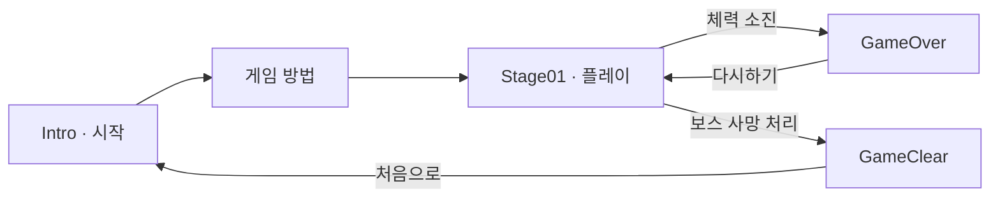

# 🐧 달펭이: 달리는 펭귄의 이야기

**장애물을 넘고 보스에게 도전하는 2D 러닝 액션 게임**

`Unity 2021.3.20f1` · `C#` · `2D` · `팀 5P`

**Space로 점프하고, M으로 공격하세요!**

---

## 🎮 게임 소개

**달펭이**는 ‘달리는 펭귄의 이야기’를 줄인 이름입니다. 펭귄 캐릭터로 다가오는 장애물과 보스의 공격을 피하고, 투사체를 발사해 보스를 쓰러뜨리는 게임입니다. 픽셀 아트 배경과 캐릭터 애니메이션을 사용하며, 메인 스테이지 1개와 시작·안내·결과 화면으로 구성됩니다.

플레이어의 체력이 소진되면 **게임 오버**, 보스의 사망 처리가 실행되면 **클리어** 화면으로 이동합니다.

## 🕹️ 조작과 진행

| 입력 | 동작 |
| --- | --- |
| `Space` | 점프 — 공중에서 다시 누르면 **2단 점프**, 착지 시 횟수 초기화 |
| `M` | 오른쪽으로 투사체 발사 — 누를 때마다 공격, 발사 간격 적용 |
| 마우스 클릭 | 메뉴 선택 및 다시하기 |

## ✨ 주요 기능

| 기능 | 설명 |
| --- | --- |
| 점프와 공격 | 지면 판정, 2단 점프, 점프 애니메이션, 투사체 발사 |
| 장애물 | 두 종류의 장애물을 무작위 간격으로 생성하고 왼쪽으로 이동 |
| 보스전 | 세로 3발·방사 방향 14발·각도 차이가 있는 5발 중 무작위 공격 |
| 체력과 피격 | 플레이어·보스 체력 바, 피격 시 빨간색 효과, 사망과 결과 화면 연결 |
| 등장 연출 | 장애물 생성 종료 후 경고 문구의 색상 전환과 보스 활성화 호출 |
| 배경과 정리 | 구름 생성·이동, 스테이지 경계를 벗어난 오브젝트 제거 |
| 점수 로직 | 보스 처치 시 50점 추가, 플레이어 사망 시 `PlayerPrefs`에 저장. 점수 UI 연결은 미확인 |

**현재 설정:** 플레이어 체력 **20**, 보스 체력 **50**, 플레이어 투사체 피해 **4**·발사 간격 **0.4초**, 보스 공격 간격 **2.7초**입니다. 장애물은 스포너 2개가 각각 **4~8초 간격으로 4개씩** 생성합니다. 값은 씬·프리팹의 Inspector에서 조정할 수 있습니다.

## 🚀 실행 방법

1. 저장소를 클론하거나 ZIP으로 내려받습니다.
2. Unity Hub에서 **Unity 2021.3.20f1**을 설치합니다.
3. `Assets`, `Packages`, `ProjectSettings`가 있는 프로젝트 루트 폴더를 추가합니다.
4. 패키지 복원과 에셋 임포트가 끝나면 `Assets/Scenes/Intro.unity`를 엽니다.
5. **Play**를 누르고 Game 뷰를 클릭해 플레이합니다.

빌드는 `File > Build Settings`에서 대상 플랫폼을 선택한 뒤 진행합니다. 씬은 `Intro → 게임 방법 → Stage01 → GameOver → GameClear` 순서로 등록되어 있습니다.

기술 구성은 **C#, Physics 2D, Unity UI, TextMesh Pro**입니다.

## 🗂️ 프로젝트와 코드 구성

| 경로 | 내용 |
| --- | --- |
| [Assets/Scripts](Assets/Scripts) | 플레이어·보스·장애물·UI 등 게임 스크립트 25개 |
| [Assets/Scenes](Assets/Scenes) | 시작, 안내, 메인 스테이지, 게임 오버, 클리어 씬 |
| [Assets/Prefabs](Assets/Prefabs) | 보스, 투사체, 장애물, 구름과 UI 프리팹 |
| [Assets/Animation](Assets/Animation) · [Assets/picture_](Assets/picture_) | 애니메이션, 타이틀·메뉴·결과 이미지 |
| [Assets/Stage01.asset](Assets/Stage01.asset) | 스테이지 경계 데이터 |
| `Packages/` · `ProjectSettings/` | 패키지 의존성과 Unity 프로젝트 설정 |

코드는 **입력 → 점프·발사 → 충돌과 체력 감소 → 결과 화면 전환**으로 연결됩니다. 생성·이동·체력·UI를 각각의 컴포넌트로 나누어 관리합니다.

<strong>전체 스크립트 역할 펼쳐보기</strong>

| 구분 | 스크립트와 역할 |
| --- | --- |
| 플레이어 | `PlayerController`: 점프·점수·사망 / `PlayerJump`: 점프 물리·애니메이션 / `PlayerShooting`: 발사·보스 접촉 / `bullet`: 투사체 피해 |
| 플레이어 UI | `PlayerHP`: 체력·피격 / `PlayerHPViewer`: 체력 바 / `PlayerScoreViewer`: 점수 표시 로직 |
| 보스 | `Boss`: 접촉·사망·클리어 / `BossHP`: 체력·피격 / `BossAttack`: 공격 패턴 / `BossProjectile`: 투사체 피해 |
| 보스 생성·UI | `BossSpawner`: 반복 생성·체력 바 연결 / `BossHPViewer`: 체력 표시 / `SliderPositionAutoSetter`: 체력 바 위치 추적 |
| 장애물 | `ObstacleSpawner`: 생성·경고 / `ObstacleScroller`: 이동 / `ObstacleCollider`: 플레이어 피해 / `ObstacleCollider2`: 보스 피해 / `MoveObstacleLeft`: 왼쪽 이동·제거 |
| 배경·범위 | `CloudSpawner`: 구름 생성 / `CloudScroller`: 구름 이동 / `StageData`: 경계 데이터 / `PositionAutoDestroyer`: 범위 밖 제거 |
| 화면·연출 | `ButtonEvent`: 씬 전환 / `TMPColor`: 경고 색상 전환 / `Assets/Jump.cs`: 실행 로직이 없는 Animator 상태 클래스 |

